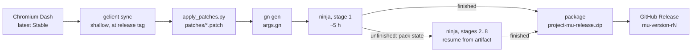

<div align="center">

# 無 &nbsp;Project Mu

**A zero-trace Chromium, built by automation instead of a fork.**

*The session exists vividly while you use it, then returns to nothing.*

</div>

> [!NOTE]
> **Status: early.** The build pipeline and the first three privacy patches are
> written and verified to apply cleanly to Chromium 156.0.8078.12. They have
> not yet been through a full CI compile. See
> [What Mu changes today](#what-mu-changes-today) for exactly what is and isn't
> covered.

---

## The philosophy

In Zen aesthetics, **Mu (無)** is the fertile void: nothingness, non-attachment,
the state before form. Project Mu treats privacy as that aesthetic rather than
as a security checklist.

| Principle | In the browser |
|---|---|
| **Mu 無**: the ephemeral void | A conventional browser hoards history, cookies, search queries and cache. Mu is built around non-attachment. A session lives in memory and is gone when the window closes. |
| **Ma 間**: negative space | No news feeds, weather widgets, shopping tiles or sync badges. The chrome steps back so the page can breathe. |
| **Ichi-go ichi-e 一期一会**: one time, one meeting | Every session is a single, unrepeatable encounter. Closing the window doesn't "clear data". The session dissolves. |
| **Shibui 渋い**: quiet restraint | Not the purple incognito theme, and not a neon gamer dark mode. Sumi ink and washi paper (see [Design system](#design-system)). |

### What Mu changes today

Each patch changes a **default**, so every setting can still be changed in
Settings. Most are the same settings an enterprise policy controls, which
upstream Chromium already tests.

| Patch | Effect |
|---|---|
| `0001` default search | DuckDuckGo is the default search engine in every region. The New Tab page stays local, so opening a tab makes no request to the search engine. |
| `0002` no history | Page visits are not written to the History database (the `SavingBrowserHistoryDisabled` mechanism). |
| `0003` Google services off | No browser sign-in prompts, no Google Translate offers, no preloading or prefetching, and metrics reporting off regardless of installer consent. |

Not covered yet: cookies, site data, cache and the downloads list still persist
between sessions until the clear-on-exit patch lands. Safe Browsing is left at
Chromium's default because it protects against phishing and malware. Note that
Safe Browsing needs Google API keys, and Mu ships without them.

### What Mu is not

Mu stops your **own machine** from remembering you. It is not an anonymity tool:
it does not hide your IP address, and the sites you visit still see your
traffic. If you need anonymity, use [Tor Browser](https://www.torproject.org/).

---

## Why patches, not a fork

Chromium is a 100 GB+ repository that changes every day. A solo developer who
forks it inherits a permanent merge war. Mu keeps **no copy of Chromium at all**.
The repository holds only a few small `.patch` files and the automation that
applies them to a fresh upstream release.

| | Traditional fork | Project Mu |
|---|---|---|
| Repository size | 100 GB+ of Chromium history | A few hundred KB |
| Tracking upstream | Rebase or merge thousands of commits | Weekly CI picks up the newest Stable tag automatically |
| What you maintain | Everything | Only the lines you changed |
| When upstream breaks a change | Merge conflicts across the tree | The patch engine halts and shows the exact hunk that no longer fits |
| Build machine | Your own 32-core workstation | GitHub's free runners |

### The pipeline



Building Chromium takes roughly 12 to 20 hours on GitHub's free 4-core Windows
runners, and a single job may run for at most 6. Mu splits the build into
chained **stages**. Each stage compiles until a time budget runs out, then
stops ninja cleanly and packs the half-built tree with 7-Zip, keeping file
timestamps exact so ninja can resume. The next stage restores it and carries on.
The first stage to finish packages the browser, and a final job publishes it.

---

## Repository layout

```text
project-mu/
├── .github/workflows/
│   ├── build-chromium.yml   # orchestrator: resolve version, 8 chained stages, release
│   └── build-stage.yml      # one ~6 h stage: sync/restore, compile, package or hand off
├── patches/
│   ├── 0001-default-search-duckduckgo.patch
│   ├── 0002-disable-history-by-default.patch
│   ├── 0003-strip-google-telemetry.patch
│   └── patch_order.list     # which .patch files apply, in order
├── scripts/
│   ├── fetch_upstream.py    # resolve the latest version; download the source tarball
│   ├── apply_patches.py     # sync src/ to the patch list; diagnose failures
│   └── build.py             # Windows build driver (sync, doctor, gen, compile, package)
├── args.gn                  # GN build flags
├── LICENSE                  # MIT
└── README.md
```

---

## Download a release

1. Open the repository's **Releases** page and download
   `project-mu-release.zip` and `project-mu-release.zip.sha256`.
2. Check the download in PowerShell:
   ```powershell
   (Get-FileHash .\project-mu-release.zip -Algorithm SHA256).Hash.ToLower()
   Get-Content .\project-mu-release.zip.sha256
   ```
   The two hashes must match.
3. Unzip it and run `project-mu-<version>\chrome.exe`. No installer is needed.

The binaries are not code-signed, so Windows SmartScreen will warn you on first
launch.

---

## Build it yourself (Windows)

### Requirements

- Windows 10/11 x64, **16 GB RAM** or more, about **100 GB free** on an NTFS drive
  that is **not** synced by OneDrive (the scripts refuse to run inside OneDrive)
- **Visual Studio 2026** (or 2022) with *Desktop development with C++* and *C++ ATL/MFC*
- **Windows SDK 10.0.28000** with *Debugging Tools for Windows*.
  `build.py doctor --install-sdk` installs it for you (needs an admin shell)
- Python 3.9 or newer, and Git

### Steps

Run these in PowerShell from the repository root:

```powershell
# 1. Choose a build folder outside OneDrive and get depot_tools
$env:MU_WORKDIR = "C:\mu-build"
git clone https://chromium.googlesource.com/chromium/tools/depot_tools.git C:\mu-build\depot_tools
$env:PATH = "C:\mu-build\depot_tools;$env:PATH"
$env:DEPOT_TOOLS_WIN_TOOLCHAIN = "0"

# 2. Check out the latest Stable Chromium (shallow; can take an hour or more) and apply the Mu patches
$v = python scripts\fetch_upstream.py --print-version
python scripts\build.py sync --version $v
python scripts\apply_patches.py

# 3. Check the toolchain; installs the Windows SDK if needed (admin shell)
python scripts\build.py doctor --install-sdk

# 4. Generate, compile and package
python scripts\build.py gen
python scripts\build.py compile chrome
python scripts\build.py package --version $v
```

The browser runs straight from `C:\mu-build\src\out\Default\chrome.exe`, and
`package` writes `project-mu-release.zip` to the repository root. A full build
takes several hours even on a fast machine. If it stops partway, run `compile`
again and ninja continues where it left off.

### Script reference

| Command | What it does |
|---|---|
| `fetch_upstream.py --print-version` | Print the latest Stable version from Chromium Dash |
| `fetch_upstream.py --workdir D:\mu` | Download the 4+ GB source tarball (resumable, SHA-256 verified) and unpack it to `src/`. Useful for writing patches without a full checkout |
| `apply_patches.py [--status \| --revert]` | Bring `src/` in line with `patch_order.list`: apply new patches, re-apply edited ones, revert removed ones |
| `build.py sync --version V` | Shallow `gclient` checkout of tag `V`, including every Windows toolchain dependency |
| `build.py doctor [--install-sdk]` | Check VS, Windows SDK, Debuggers, depot_tools, ninja and free disk |
| `build.py gen` | Copy `args.gn` to `out/Default` and run `gn gen` |
| `build.py compile [targets] [--deadline T \| --budget-minutes M]` | Run ninja, stopping cleanly when time runs out (used by CI) |
| `build.py package --version V` | Zip Chromium's official Windows file set into `project-mu-release.zip` |
| `build.py pack-state` / `unpack-state` | Carry a half-built tree between CI stages |

Every script accepts `--help`.

---

## Working with patches

A patch is an ordinary `git diff` of the Chromium tree. After `build.py sync`,
`src/` is a git checkout, so:

```powershell
# edit files under C:\mu-build\src, then write the diff straight to a file
git -C C:\mu-build\src diff --output="$PWD\patches\0004-my-change.patch" -- path/to/file.cc
```

Use `--output` rather than `>` redirection. Windows PowerShell can re-encode
redirected output (UTF-16, or a byte-order mark), and the patch tools cannot
read that. Then add the file
name to `patches/patch_order.list` and run `python scripts\apply_patches.py`.

**When upstream moves.** If a new Chromium release changes code a patch
touches, `apply_patches.py` stops at that patch and prints the file and line,
the hunk the patch expected, and the code that is there now. Rebase the patch
by hand against the new source and rerun. Patches already applied are recorded
in `src/.mu/`, so reruns never apply anything twice.

---

## Continuous integration

- **Triggers:** every Monday at 02:23 UTC, or manually from *Actions → Build
  Chromium → Run workflow*, optionally pinning a version.
- **Skip rule:** a scheduled run does nothing if a release for the current
  Stable version already exists. Manual runs always build.
- **Runner:** `windows-2025-vs2026`. Each stage installs Windows SDK 10.0.28000
  if it is missing. Stage 1 builds on the drive with the most free space, and
  later stages reuse the same path so ninja's recorded paths stay valid.
- **Stages:** stage 1 syncs, patches and generates. Every stage compiles for
  about 290 minutes, then either packages the browser or uploads its state as a
  one-day artifact for the next stage. Eight stages are defined. To allow more,
  copy the last stage block in `build-chromium.yml`, bump its number, move
  `last: true` to it, and add it to the release job's `needs`.
- **Release:** tagged `mu-<chromium-version>-r<run-number>`, with the zip and its
  SHA-256.

The repository should be **public**. Public repos get free 4-core / 16 GB
Windows runners. Private repos get 2-core / 8 GB runners on metered minutes,
which roughly doubles the number of stages a build needs.

---

## Design system

| Token | Hex | Role |
|---|---|---|
| Sumi (void black) | `#090A0C` | Primary background |
| Kiri (misty slate) | `#1E2024` | Surfaces, tabs, omnibox |
| Washi (rice paper) | `#E2E8F0` | Text |
| Inkan (seal red) | `#DC2626` | Used only for the "return to Mu" purge interaction, like a red ink seal |

Toggles should feel mechanical and deliberate. Closing the browser should feel
like ink dissolving, not like "Closing 12 tabs…".

---

## Roadmap

| | Item |
|---|---|
| ✅ | Upstream version resolver and verified tarball fetcher |
| ✅ | Patch engine with revert, re-sync and failure diagnostics |
| ✅ | Staged Windows CI and automatic GitHub Releases |
| ✅ | `0001` DuckDuckGo as the default search engine, local New Tab page |
| ✅ | `0002` history saving off by default |
| ✅ | `0003` sign-in, Translate, preloading and metrics off by default |
| ⬜ | First full CI build with the patch set |
| ⬜ | Sumi/Washi theme and a minimal New Tab page |
| ⬜ | Clear cookies and site data on exit, with the Inkan purge micro-interaction |
| ⬜ | Mu branding (name, icons, `mu.exe`) |

---

## Acknowledgements

- [The Chromium Project](https://www.chromium.org/), which Mu is built on.
- [ungoogled-chromium](https://github.com/ungoogled-software/ungoogled-chromium)
  and its Windows port, which showed that a patch-based browser can stay
  current with upstream.
- [depot_tools](https://chromium.googlesource.com/chromium/tools/depot_tools.git)
  for `gclient`, `gn` and the toolchain plumbing.

## License

Project Mu's own code is released under the [MIT License](LICENSE). Chromium and
its components keep their own licenses (BSD-style and others). Every build
shows Chromium's full license notices at `chrome://credits`.
# project-mu
